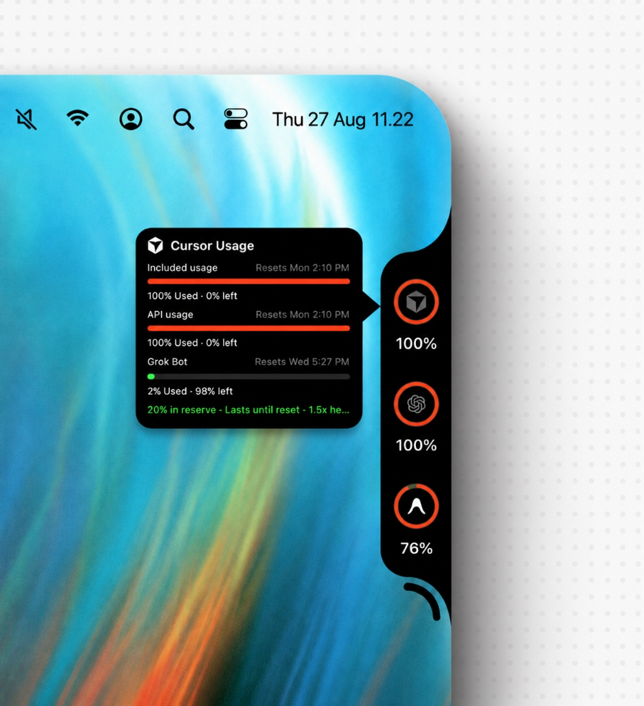

# Codenotch

A native macOS status companion that anchors an ambient notch to your screen bezel, displaying real-time AI quota windows, reset deadlines, burn-rate forecasts, live agent states, and local token spend.



## Lineage & Acknowledgements

Codenotch is built on the ideas, architecture, and craftsmanship of two upstream projects:

- **[Code Notch](https://github.com/vinzdg/codenotch)** (by [@vinzdg](https://github.com/vinzdg)): Provided the original vision for the bezel-hugging floating notch, Apple hardware notch integration, fluid AppKit/SwiftUI folding animations, and the tactile settings orb.
- **[CodexBar](https://github.com/steipete/CodexBar)** (by [@steipete](https://github.com/steipete) and contributors): Provided the industry-standard blueprint for local session discovery, multi-provider rate limit extraction, and mathematical pace forecasting.

We borrowed heavily from both repositories, refined the implementations, and brought them together into a unified, integrated experience: pairing Code Notch’s glanceable, physical-feeling interface with CodexBar’s comprehensive provider coverage, quota cadence distinctions (5-hour vs. weekly limits), and token cost store—all while stripping out external update feeds, telemetry, and background trackers.

---

## Core Capabilities

- **Ambient Bezel Presence:** Anchors to the left, right, top, or bottom of any screen. When placed on the top edge of a MacBook display with a camera notch, it merges directly into the display cutout and expands smoothly on hover.
- **Cadence & Burn-Rate Estimation:** Tracks both short-term session windows (5-hour limits) and long-term allocations (weekly/monthly quotas). Calculates linear and work-schedule-adjusted burn rates to project whether allowance will hold until reset or exhaust early ("N% in reserve · Lasts until reset" vs "N% in deficit · Runs out in 2h").
- **Real-Time Agent Monitor:** Circular rings indicate whether local developer tools and agents are active, idling, or paused awaiting user confirmation. Hovering surfaces working directories, task summaries, and run durations.
- **Offline Token & Cost Ledger:** Parses local CLI rollout logs and editor state stores to measure model usage against rate cards, calculating daily and 30-day estimated dollar spend without external network queries.
- **Privacy First:** Reads credentials strictly from existing local sessions, local configuration files, and the macOS Keychain. Zero analytics, zero phone-home calls, and zero background updaters.

---

## Supported Providers

| Provider | Access Method | Windows & Capabilities |
| :--- | :--- | :--- |
| **Claude** | Claude Code OAuth session (`login.keychain`) | 5-hour session and weekly limits, active session states |
| **Cursor** | Editor local SQLite state store | Included plan usage, on-demand allowance, Sand / Grok Bot quotas |
| **Codex** | Local app server & rollout logs | 5-hour limits, weekly allocations, live rollout execution states |
| **Antigravity** | Local language server process (`127.0.0.1`) | Distinct Gemini & Claude/GPT 5-hour session and weekly limits |
| **GitHub Copilot** | GitHub CLI (`~/.config/gh/hosts.yml`) / Keychain | Chat allowances, premium interactions, and quota reset deadlines |
| **Grok** | Grok CLI credentials (`~/.grok/auth.json`) | SuperGrok credit balance and on-demand limits |
| **OpenRouter** | `OPENROUTER_API_KEY` / Keychain | Credit balance, key spending limits, daily usage figures |
| **DeepSeek** | `DEEPSEEK_API_KEY` / Keychain | Total balance, granted balance, topped-up balance |
| **OpenAI Platform** | `OPENAI_API_KEY` / Keychain | Credit grants, expiration dates, available balance |
| **Windsurf** | Editor local SQLite state store | Daily and weekly quota percentages, reset deadlines, message limits |
| **Ollama** | Local engine API (`127.0.0.1:11434`) | Active running model, VRAM memory footprint, installed model catalog |
| **Groq** | `GROQ_API_KEY` / Keychain | Requests per minute, tokens per minute, LPU inference status |
| **Mistral / Codestral** | `MISTRAL_API_KEY` / Keychain | Codestral code completion availability, model catalog status |
| **Perplexity** | `PERPLEXITY_API_KEY` / Session Cookie | Pro searches, research queries, and free query limits |

---

## Interaction & Configuration

- **Hover to Unfold:** Hovering over any provider ring slides out a dedicated detail card displaying limit bars, reset deadlines, burn rates, and active session lists.
- **Screen Edge Placement:** Configure screen placement (Left, Right, Top, Bottom) in Settings. Notch coordinates dynamically account for the macOS menu bar and Dock.
- **Settings Orb:** Nestled next to the notch body. Click to toggle visibility modes (Always Show, On Hover, or Hidden), choose screen edges, toggle menu bar presence, or enable/disable specific providers.
- **Simple Settings:** One grouped settings page refreshes provider readings and local usage estimates whenever it opens or comes back into focus, so it never asks you to manage a separate refresh workflow.

---

## Credentials & Authentication

Codenotch leverages the developer tools already authenticated on your system:

1. **Local CLI & Editor Sessions:** Automatically picks up authenticated tokens from Claude Code, GitHub CLI (`gh`), Grok CLI, Cursor, and Codex.
2. **Environment & Keychain Secrets:** For direct API services (OpenRouter, DeepSeek, OpenAI), configure keys via environment variables (e.g. `OPENROUTER_API_KEY`) or store them securely in the macOS Keychain through `SecretStore`.

---

## Building from Source

### Requirements
- macOS 26.0 (Tahoe) or newer
- Xcode 17+
- [XcodeGen](https://github.com/yonaskolb/XcodeGen) (`brew install xcodegen`)

### Build Commands
```sh
# Generate Xcode project, compile, and run debug build
make run

# Run the complete test suite (500+ unit tests)
make test

# Build, sign, and notarize release DMG
make release
```

---

## Diagnostic Logs

Codenotch logs diagnostics to Apple's Unified Logging subsystem:

```sh
log stream --predicate 'subsystem == "com.soulsniper.codenotch"' --level debug
```
